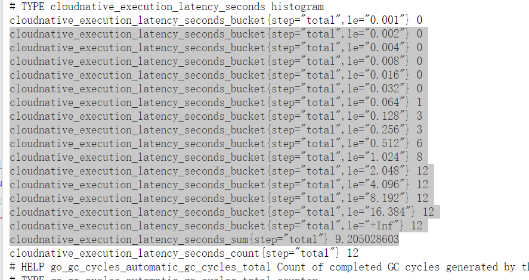

# 模块10作业：
- 为 HTTPServer 添加 0-2 秒的随机延时；
- 为 HTTPServer 项目添加延时 Metric；
- 将 HTTPServer 部署至测试集群，并完成 Prometheus 配置；
- 从 Promethus 界面中查询延时指标数据；
- （可选）创建一个 Grafana Dashboard 展现延时分配情况。


- 增加延时
```
func images(w http.ResponseWriter, r *http.Request) {
		timer := metrics.NewTimer()
		defer timer.ObserveTotal()
		randInt := rand.Intn(2000)
		time.Sleep(time.Millisecond * time.Duration(randInt))		
		w.Write([]byte(fmt.Sprintf("<h1>%d<h1>", randInt)))	
}
```

- 延时的metric

```
func main() {		
metrics.Register()		
mux := http.NewServeMux()    	
mux.HandleFunc("/", index)		
mux.HandleFunc("/images", images)		
mux.Handle("/metrics", promhttp.Handler())		
mux.HandleFunc("/healthz", healthz)		
if err := http.ListenAndServe(":8080", mux); err != nil {
			log.Fatalf("start http server failed, error: %s\n", err.Error())
}	
}
```


- metrics.go

```
  package metrics
  import (   
  "fmt"   
  "time"   
  "github.com/prometheus/client_golang/prometheus")
  
  func Register() {
     err := prometheus.Register(functionLatency)
     if err != nil {
          fmt.Println(err)   
     }      
  }
  
  const (   MetricsNamespace = "cloudnative")
  
  // NewExecutionTimer provides a timer for Updater's RunOnce execution
  func NewTimer() *ExecutionTimer {
    return NewExecutionTimer(functionLatency)
  }
  var (   functionLatency = CreateExecutionTimeMetric(MetricsNamespace,      "Time spent."))
  // NewExecutionTimer provides a timer for admission latency; call ObserveXXX() on it to measure
  func NewExecutionTimer(histo *prometheus.HistogramVec) *ExecutionTimer {
     now := time.Now()   
     return &ExecutionTimer{
           histo: histo,
           start: now,
           last:  now,
           }
     }
     
     // ObserveTotal measures the execution time from the creation of the ExecutionTimer
     func (t *ExecutionTimer) ObserveTotal() {
            (*t.histo).WithLabelValues("total").Observe(time.Now().Sub(t.start).Seconds())
     }
     
     // CreateExecutionTimeMetric prepares a new histogram labeled with execution step
     func CreateExecutionTimeMetric(namespace string, help string) *prometheus.HistogramVec {
        return prometheus.NewHistogramVec(
              prometheus.HistogramOpts{
              Namespace: namespace,
              Name:      "execution_latency_seconds",
              Help:      help,
              Buckets:   prometheus.ExponentialBuckets(0.001, 2, 15),
         }, []string{"step"},   
         )
     }
      
      // ExecutionTimer measures execution time of a computation, split into major steps
      // usual usage pattern is: timer := NewExecutionTimer(...) ; compute ; timer.ObserveStep() ; ... ; timer.ObserveTotal()
      type ExecutionTimer struct {
         histo *prometheus.HistogramVec
         start time.Time
         last  time.Time
      }
```

- 参考链接 
- https://github.com/kubernetes/autoscaler/blob/master/vertical-pod-autoscaler/pkg/utils/metrics/metrics.go
