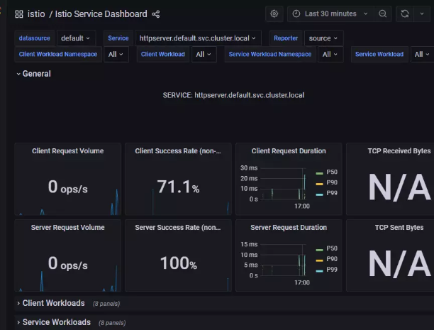

# 模块12作业： 把我们的 httpserver 服务以 Istio Ingress Gateway 的形式发布出来。以下是你需要考虑的几点：
- 如何实现安全保证；
- 七层路由规则；
- 考虑 open tracing 的接入。


- 部署gateway并且暴露服务
- 之前部署的时候是只有一个容器的pod，namespace inject之后，将pod重建一下

```
root@master01:~# kubectl get pod
NAME                         READY   STATUS    RESTARTS   AGE
httpserver-8d6ff89df-9wtxd   1/1     Running   0          6d18h
root@master01:~#

root@master01:~# kubectl delete pod httpserver-8d6ff89df-9wtxd
pod "httpserver-8d6ff89df-9wtxd" deleted

root@master01:~#
root@master01:~# kubectl get pod
NAME                         READY   STATUS    RESTARTS   AGE
httpserver-8d6ff89df-89xv7   1/2     Running   0          9s
root@master01:~# kubectl get pod
NAME                         READY   STATUS    RESTARTS   AGE
httpserver-8d6ff89df-89xv7   2/2     Running   0          14s
root@master01:~#
```


- 建一个http的gateway
```
  apiVersion: networking.istio.io/v1beta1
  kind: Gateway
  metadata:
  name: gateway
  spec:
  selector:
  istio: ingressgateway
  servers:
    - port:
      number: 80
      name: http
      protocol: HTTP
      hosts:
        - '*'
```

```
root@master01:~# kubectl create -f httpgw.yaml
gateway.networking.istio.io/gateway created
root@master01:~# kubectl get gw
NAME      AGE
gateway   7s
```


- 部署virtualserver

```
  kind: VirtualService
  metadata:
  name: httpserver
  spec:
  hosts:
    - "*"
      gateways:
    - gateway
      http:
    - route:
        - destination:
          host: httpserver.default.svc.cluster.local
          port:
          number: 80
```

```
root@master01:~# curl 20.121.94.51/healthz
working
```

-证书

修改cert manager issuer

如果是用let's encrtpy，修改cert issuer的验证方式从nginx变成dns01

```
    server: https://acme-v02.api.letsencrypt.org/directory
    solvers:
    - http01:
        ingress:
          class: nginx
```


-手动签发   如果是手动签发证书，这里直接签发一个wildcard证书

```
openssl req -x509 -sha256 -nodes -days 365 -newkey rsa:2048 -subj '/O=cloudnative Inc./CN=*.51.cafe' -keyout51.cafe.key -out 51.cafe.crt

kubectl create -n istio-system secret tls wildcard-credential --key=51.cafe.key --cert=51.cafe.crt
```


-使用letsencrypt申请一张证书

```
apiVersion: cert-manager.io/v1
kind: Certificate
metadata:
name: httpserver
namespace: default
spec:
dnsNames:
- httpserver-mesh.51.cafe
  issuerRef:
  group: cert-manager.io
  kind: Issuer
  name: letsencrypt-prod
  secretName: httpserver
  usages:
- digital signature
- key encipherment 
```


-不修改issuer就会从原来的nginx那边去做验证

```
E0327 07:53:23.736333       1 sync.go:186] cert-manager/challenges "msg"="propagation check failed" "error"="wrongstatus code '404', expected '200'" "dnsName"="httpserver-mesh.51.cafe" "resource_kind"="Challenge""resource_name"="httpserver-s4w7x-3039856568-1096225648" "resource_namespace"="default""resource_version"="v1" "type"="HTTP-01"

```

- 部署gateway
- 注意几个点
- 1.credentialName的httpserver-helm 是一定要在istio-system的ns里
- 2.如果你原来用cert manager已经签发的话，可以挪到istio-system里直接用
```
apiVersion: networking.istio.io/v1beta1
kind: Gateway
metadata:
name: httpsserver
namespace: default
spec:
selector:
istio: ingressgateway
servers:
- hosts:
    - httpserver-helm.51.cafe
      port:
      name: https-default
      number: 443
      protocol: HTTPS
      tls:
      credentialName: httpserver-helm
      mode: SIMPLE

```

- 部署virtual server
```
root@master01:~# kubectl get vs
NAME         GATEWAYS          HOSTS                         AGE
httpserver   ["httpsserver"]   ["httpserver-helm.51.cafe"]   56m

```


```
apiVersion: networking.istio.io/v1beta1
kind: VirtualService
metadata:
name: httpserver
namespace: default
spec:
gateways:
- httpsserver
  hosts:
- httpserver-helm.51.cafe
  http:
- route:
    - destination:
      host: httpserver.default.svc.cluster.local
      port:
      number: 80
```

- 验证
```
  root@master01:~# curl https://httpserver-helm.51.cafe/healthz
  working
```

- 如果自签名验证
```
curl --resolve {domain}:443:10.103.209.71 https://{domain/url} -H "Custom-header: hello" -v -k
```


- 故障注入

- 1.50%的500错误

```
apiVersion: networking.istio.io/v1beta1
kind: VirtualService
metadata:
  name: httpserver
spec:
  hosts:
    - httpserver-helm.51.cafe
  gateways:
    - httpsserver
  http:
    - route:
        - destination:
            host: httpserver.default.svc.cluster.local
            port:
              number: 80
      fault:
        abort:
          httpStatus: 500
          percentage:
            value: 50 

```

- 2. 延时
```
apiVersion: networking.istio.io/v1beta1
   kind: VirtualService
   metadata:
   name: httpserver
   spec:
   hosts:
    - httpserver-helm.51.cafe
      gateways:
    - httpsserver
      http:
    - route:
        - destination:
          host: httpserver.default.svc.cluster.local
          port:
          number: 80
          fault:
          delay:
          percent: 50
          fixedDelay: 5s

```
   
